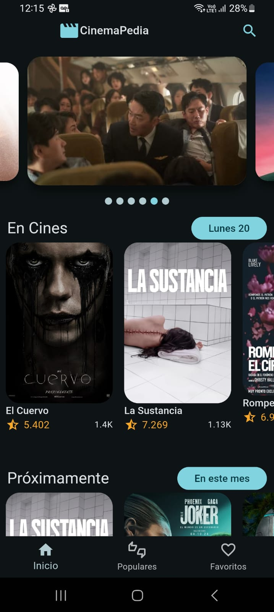
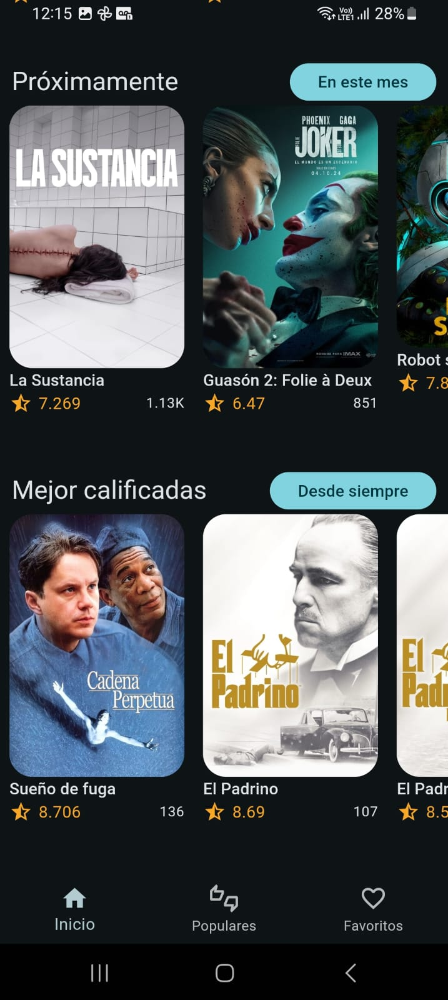
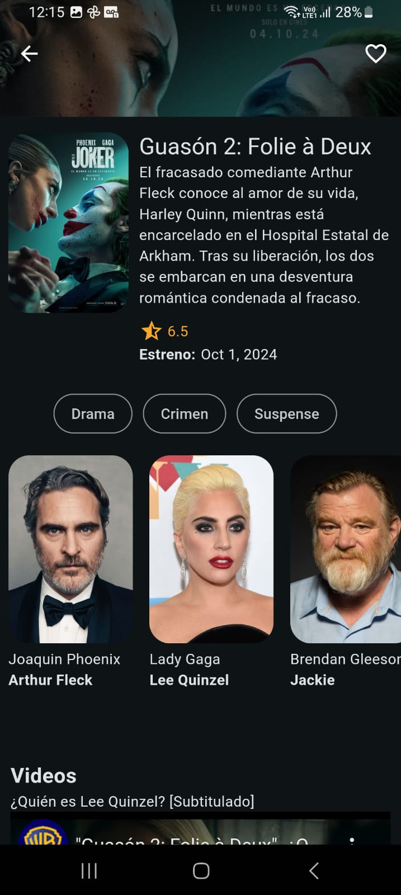
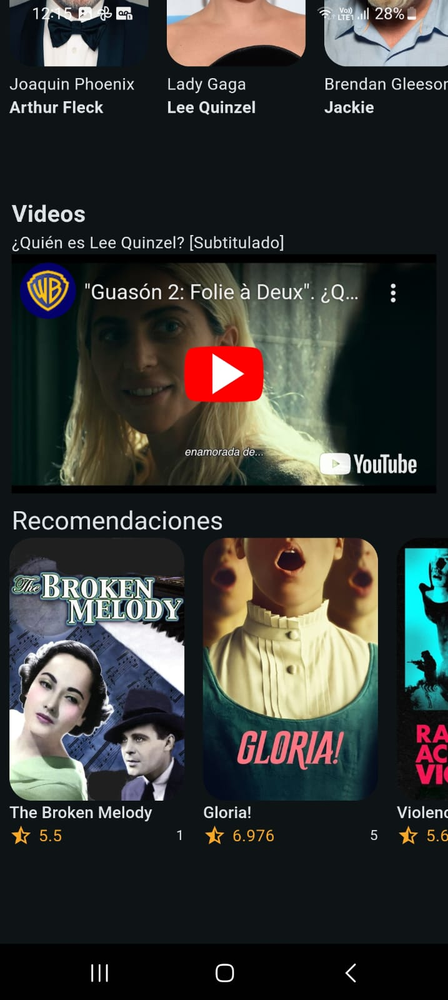
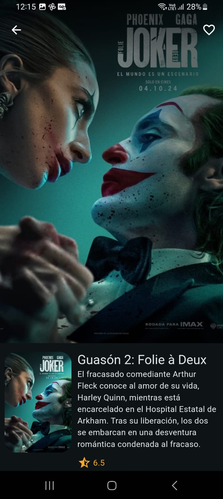
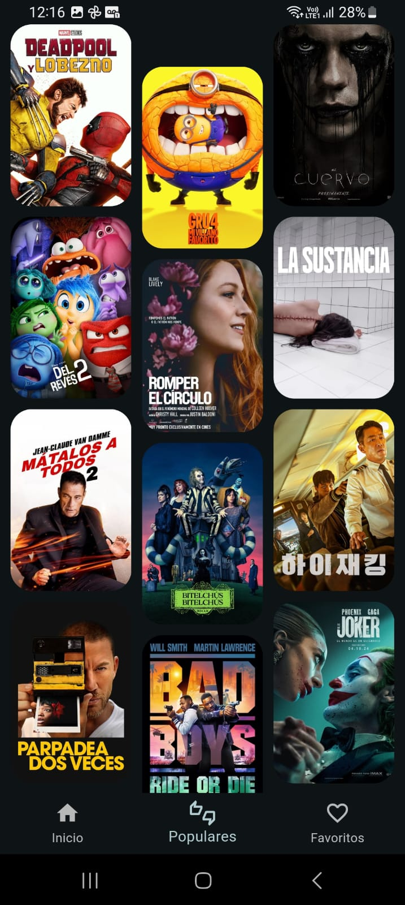
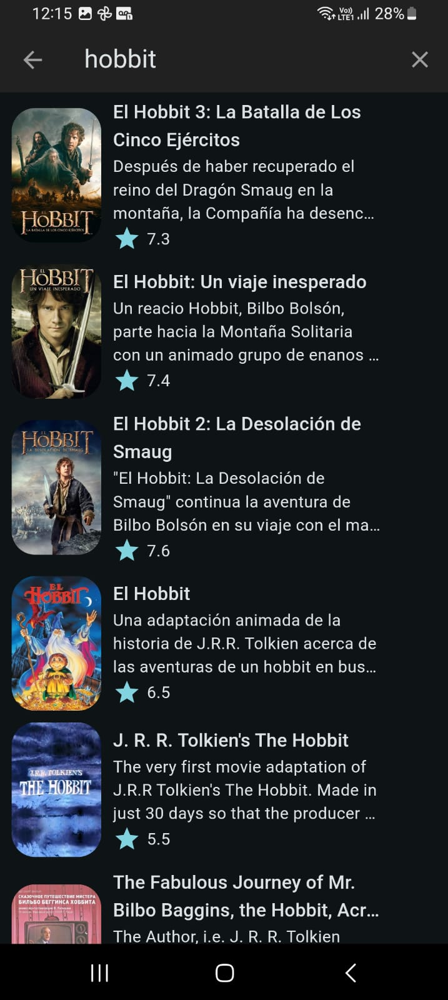

#Dev
1. Copiar el .env.template y renombrarlo a .env
2. Cambiar las variables de entorno (The movie DB)
3. Cambios en la entidad, hay que ejecutar el comando: 'flutter pub run build_runner build'.

# 🎥 CinemaPedia - Aplicación Móvil con Flutter

**CinemaPedia** es una aplicación móvil desarrollada con **Flutter** que permite a los usuarios buscar información sobre películas, leer sinopsis, ver trailers y más. Utiliza la API de **The Movie Database (TMDb)** para obtener información actualizada sobre películas y actores.         |

## 🚀 Características

- 🎬 **Búsqueda avanzada** de películas por título o género.
- ⭐ **Lista de películas populares** actualizada.
- 📽️ **Trailers** y videos promocionales de películas.
- 🎥 **Detalles completos** de cada película (sinopsis, reparto, puntuación).
- 💾 **Sistema de favoritos** para guardar tus películas preferidas.
- 🔍 **Sugerencias automáticas** mientras escribes.
- 📅 **Fechas de lanzamiento y datos adicionales.**

## 🛠️ Instalación

Sigue estos pasos para instalar y correr la aplicación en tu entorno local:

```bash
1. Clona este repositorio:
git clone https://github.com/AndrexMed/cinemapedia.git

2. Navega a la carpeta del proyecto:

3. Instala las dependencias:
flutter pub get

4. Corre la aplicación en un emulador o dispositivo físico:
flutter run


📚 Tecnologías Utilizadas
Flutter: Framework principal para la creación de la app.
Dart: Lenguaje de programación.
The Movie Database API: Fuente de datos de películas.
RiverPod: Para el manejo del estado.
Flutter Hooks: Simplificación de la gestión del ciclo de vida en widgets.
Dio: Cliente HTTP para la comunicación con la API.


🌟 Próximas Mejoras
Soporte para actores y directores.
Filtrado por géneros y puntuación.
Multilenguaje (inglés, español, etc.).

📄 Licencia
Este proyecto está bajo la Licencia MIT - mira el archivo LICENSE para más detalles.

👤 Autor
Nombre: Giovanni Andres Alzate Agudelo
Correo: giovanniandrex@gmail.com

📝 Contribuciones
¡Las contribuciones son bienvenidas! Si deseas mejorar el proyecto, siéntete libre de crear un pull request o abrir un issue.
```

## 🖼️ Capturas de Pantalla   
<div style="display: flex; flex-wrap: wrap; justify-content: space-around;">
    
    
    
    
    
    
    
</div>
